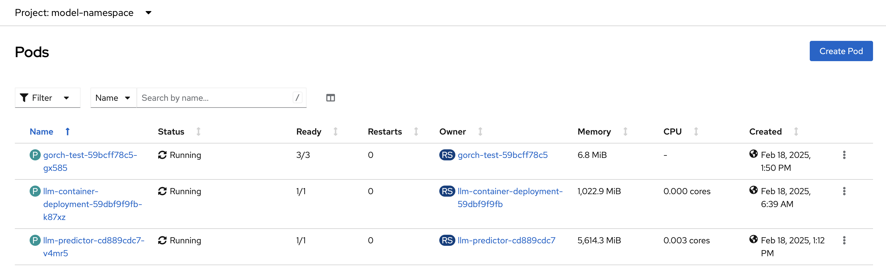
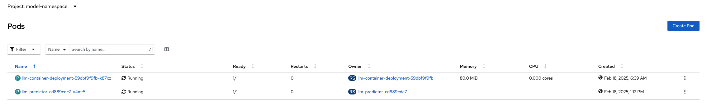
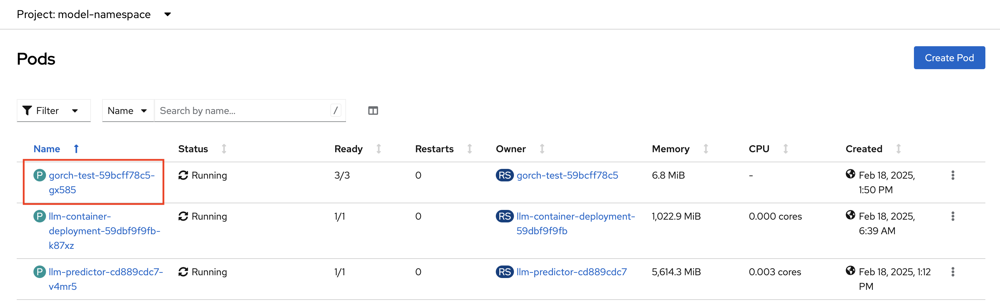
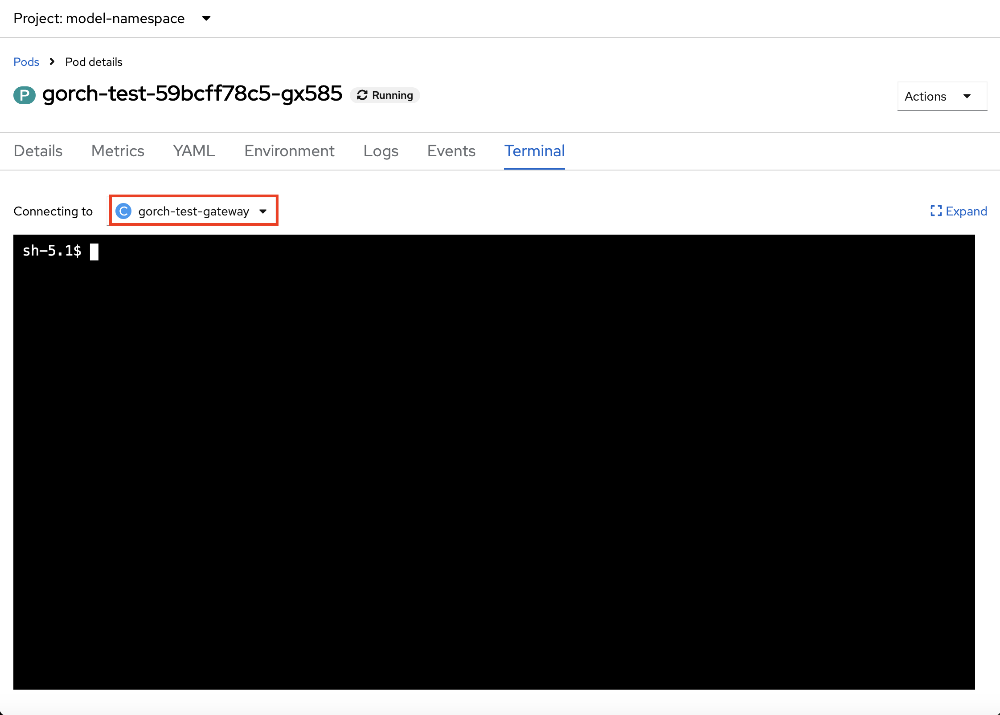
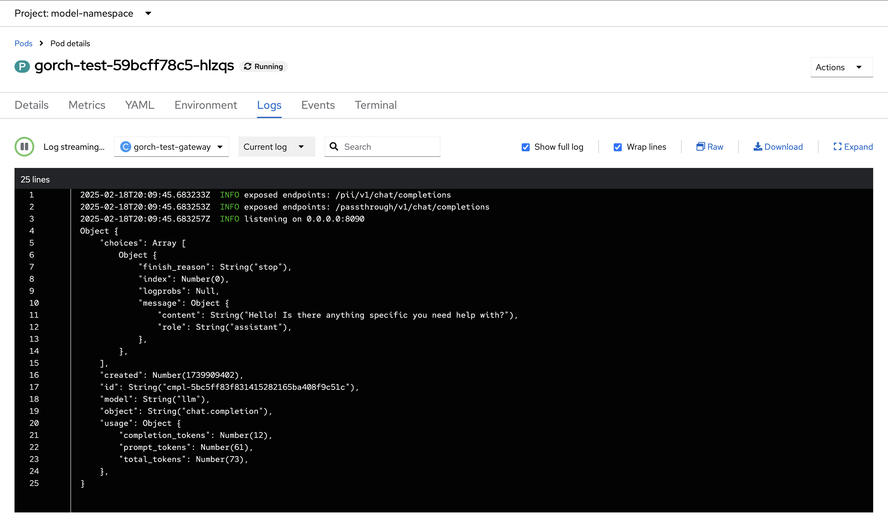
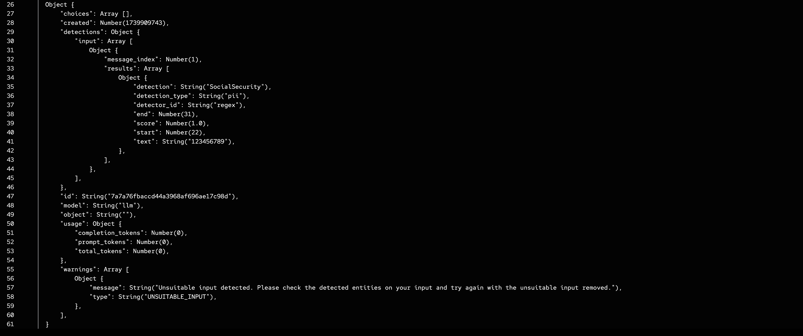

# Guardrailing LLMs via TrustyAI in ODH

This demo will explore how to use TrustyAI to moderate LLM output content. By the end of it, you will have **1) deployed an LLM and 2) guardrailed the LLM from generating content exposing PII, in particular email addresses and social security numbers**

GuardrailsOrchestrator is currently only available via **KServe RawDeployment** mode; for a guide on how to install KServe RawDeployment on Open Data Hub, refer to this [installation guide](https://access.redhat.com/solutions/7078183).

## Context
GuardrailsOrchestrator is a service to moderate LLM input and output content by invoking detections on text. It is based on the upstream open-source project, [FMS Guardrails Orchestrator](https://github.com/foundation-model-stack/fms-guardrails-orchestrator).
Some revelant vocabulary is defined as follows:

* Orchestrator - Server for invocation of detections on input and/or output of a text generation model as well as standalone detection
* Detector - Server responsible for running detection of a certain class of content on text spans
* Chunker - Server responsible for splitting text into spans

## Setup
At the time of this publication, GuardrailsOrchestrator is only available on TrustyAI Service Operator's `main` branch. In order to use it on Open Data Hub, add the following devFlag to your DataScienceCluster (DSC) resource:
```
trustyai:
    devFlags:
        manifests:
            - contextDir: config
        sourcePath: ''
        uri: https://github.com/trustyai-explainability/trustyai-service-operator/tarball/dev/main
    managementState: Managed
```

## Deploy LLM
1. Navigate to the `model-namespace` created in the setup section: `oc project model-namespace`

2. Deploy the LLM by running the following command: `oc apply -k resources/generator/kustomization.yaml`

3. From the OpenShift Console, navigate to the `model-namespace` project and look at the Workloads -> Pods screen. You should see the following pods:

    

## Deploy a GuardrailsOrchestrator instance
1. Deploy the regex detectors and vLLM gateway image configmap: `oc apply -f resources/vllm_images_cm.yaml`

2. Deploy the detectors configmap: `oc apply -f detectors_cm.yaml`

3. Deploy the orchestrator configmap: `oc apply -f resources/orchestrator_cm.yaml`

4. Deploy the Guardrails Orchestrator custom resource: `oc apply -f guardrails_crd.yaml`

This action will create deployment, service, and route object in the `model-namespace` project

5. From the Openshift Console, navigate to the `model-namespace` project and look at the Workloads -> Pods screen. In addition to the LLM pods, you will see a GuardrailsOrchestrator pod:

    

6. Sense-check the health of your generator and detector services by retriving the health route of the orchestrator service:`GORCH_HEALTH_ROUTE=$(oc get routes gorch-test-health -o jsonpath='{.spec.host}')`


    a) Query the `/health` endpoint: `curl -v https://$GORCH_ROUTE_HEALTH/health`

    Expected output:
    ```
    *   Trying ::1:8034...
    * connect to ::1 port 8034 failed: Connection refused
    *   Trying 127.0.0.1:8034...
    * Connected to localhost (127.0.0.1) port 8034 (#0)
    > GET /health HTTP/1.1
    > Host: localhost:8034
    > User-Agent: curl/7.76.1
    > Accept: */*
    >
    * Mark bundle as not supporting multiuse
    < HTTP/1.1 200 OK
    < content-type: application/json
    < content-length: 36
    < date: Fri, 31 Jan 2025 14:04:25 GMT
    <
    * Connection #0 to host localhost left intact
    {"fms-guardrails-orchestr8":"0.1.0"}
    ```

    b) Query the `/info` endpoint: `curl -v https://$GORCH_ROUTE_HEALTH/info`

    Expected output:
    ```
        *   Trying ::1:8034...
    * connect to ::1 port 8034 failed: Connection refused
    *   Trying 127.0.0.1:8034...
    * Connected to localhost (127.0.0.1) port 8034 (#0)
    > GET /info HTTP/1.1
    > Host: localhost:8034
    > User-Agent: curl/7.76.1
    > Accept: */*
    >
    * Mark bundle as not supporting multiuse
    < HTTP/1.1 200 OK
    < content-type: application/json
    < content-length: 82
    < date: Fri, 31 Jan 2025 14:05:10 GMT
    <
    * Connection #0 to host localhost left intact
    {"services":{"chat_generation":{"status":"HEALTHY"},"regex":{"status":"HEALTHY"}}}
    ```

## Guardrailing LLM Input Prompts
1. From the Openshift Console, navigate to the `model-namespace` project and click on the GuardrailsOrchestrator pod:

    

2. Click on the `Terminal` tab and from the dropdown menu, select the `gorch-test-gateway` container:

    

3. First, query the `/passthrough/v1/chat/completions` from the container terminal to generate content without any guardrails:
    ```
    curl localhost:8090/passthrough/v1/chat/completions \
    -H "Content-Type: application/json" \
    -d '{
        "model": "llm",
        "messages": [
            {
                "role": "user",
                "content": "say hello to me at someemail@somedomain.com"
            },
            {
                "role": "user",
                "content": "btw here is my social 123456789"
            }
        ]
    }'
    ```
    The payload is structured as follows:
    * `model`: The name of the model to query
    * `messages`: Input prompts

    Click on the `Logs` tab and from the dropdown menu, select the `gorch-test-gateway` container to view the output:
    

4. Return to the `gorch-test-gateway` container terminal and query the `/pii/v1/chat/completions` endpoint to perform completions while guardrailing against `pii`:

     ```
    curl localhost:8090/passthrough/v1/chat/completions \
    -H "Content-Type: application/json" \
    -d '{
        "model": "llm",
        "messages": [
            {
                "role": "user",
                "content": "say hello to me at someemail@somedomain.com"
            },
            {
                "role": "user",
                "content": "btw here is my social 123456789"
            }
        ]
    }'
    ```

    Again, click on the `Logs` tab and from the dropdown menu, select the `gorch-test-gateway` container to view the output:
    
