# Model Trust Region Identifier via TrustyAI in ODH

<Generic requirement for this algorithm>
<An example requirement for this algorithm>


## Context
<Use case specific detail>
<Target using Model Trust>

## Setup

1.  Follow the instructions in [Installation](https://github.com/trustyai-explainability/odh-trustyai-demos/tree/main/1-Installation). Afterwards, you should have an ODH installation, a TrustyAI Operator, and a model-namespace project containing an instance of the TrustyAI Service.

> **_NOTE:_** This document is prepared using ODH 1.11.1 and must be verified on ODH v2.

2.  This demo uses OpenShift Data Science Pipelines to train and deploy Model Trust pipeline. Install data science pipelines in OpenDataHub.
    *   Find and open the OpenDataHub dashboard url from OpenShift routes in "opendatahub" project (or the project you used to install OpenDataHub).
    *   Follow the steps provided in [installing pipelines](https://docs.openshift.com/container-platform/4.9/cicd/pipelines/installing-pipelines.html) to install OpenShift pipelines. This will enable Data Science pipelines in ODH.

3.  Create a data science project `model-trust-ds-project` in ODH dashboard.

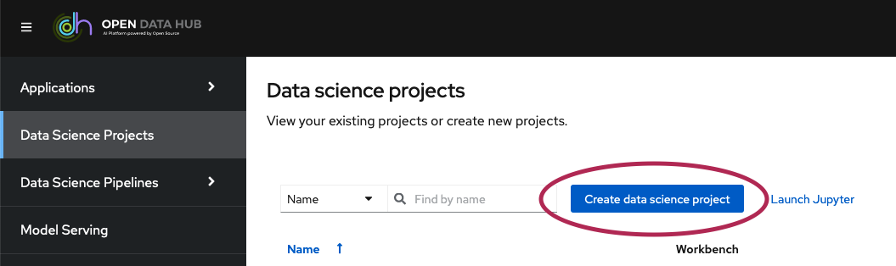

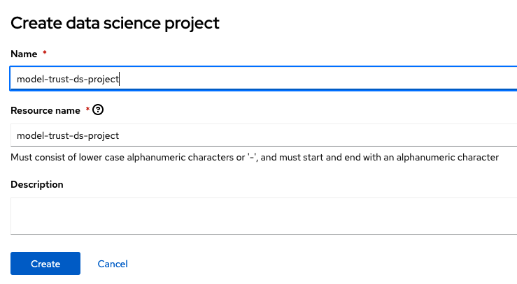


4.  Select the above created data science project and create a data connection for AWS S3 or IBM Cloud Object Storage. 

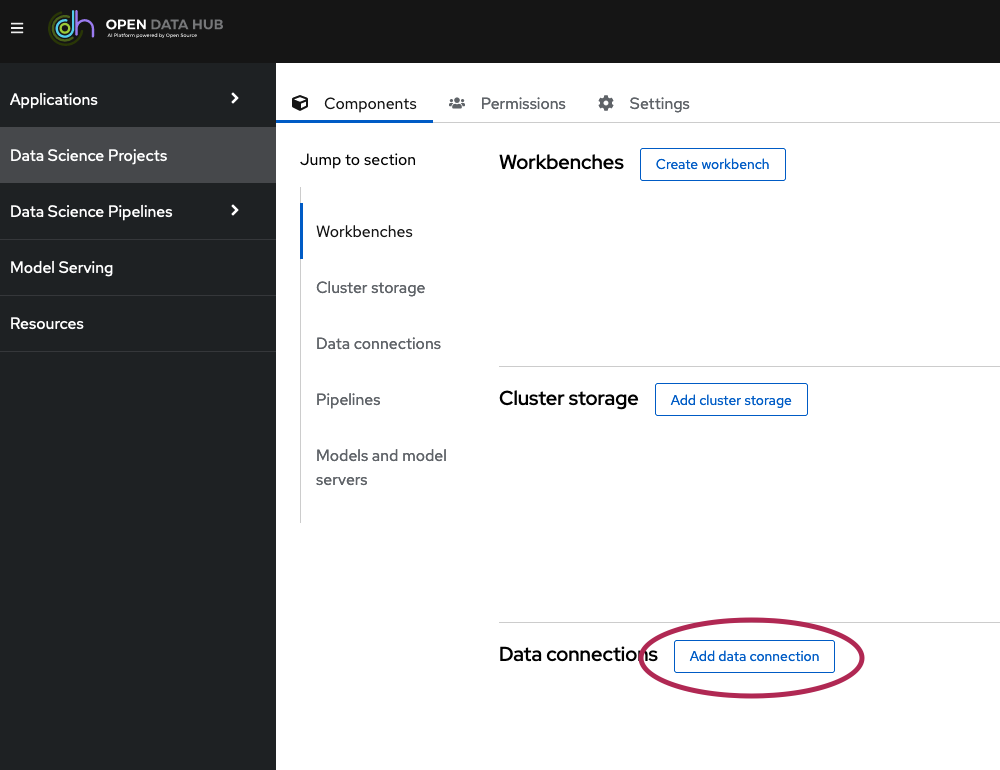

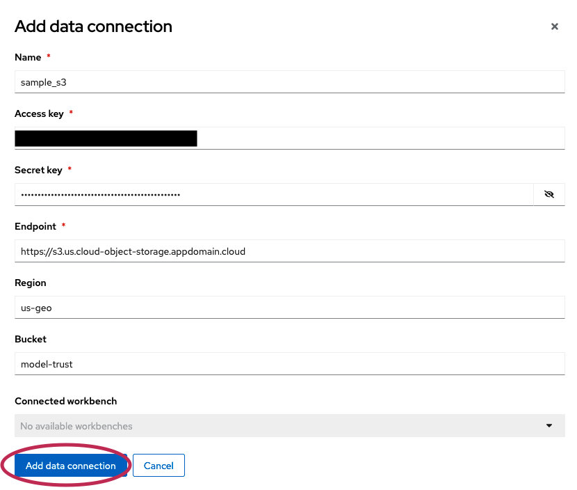

5.  Create a workbench to track pipelines and runs.

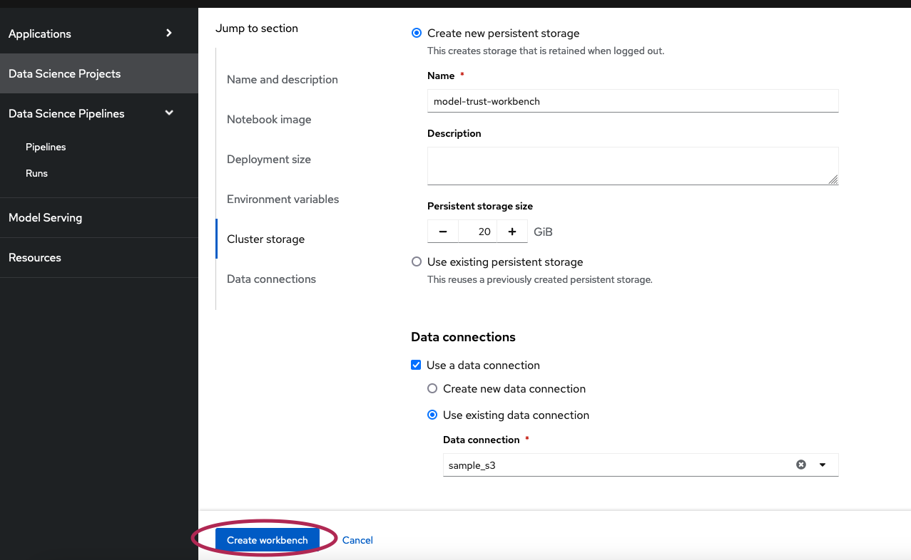


6.  Create and configure pipeline server.

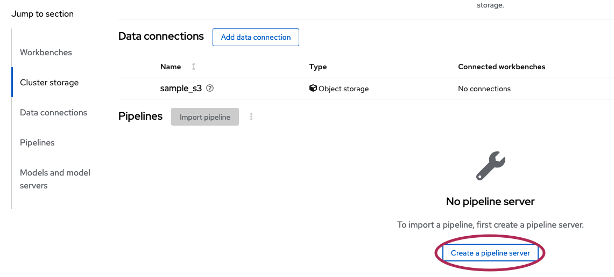

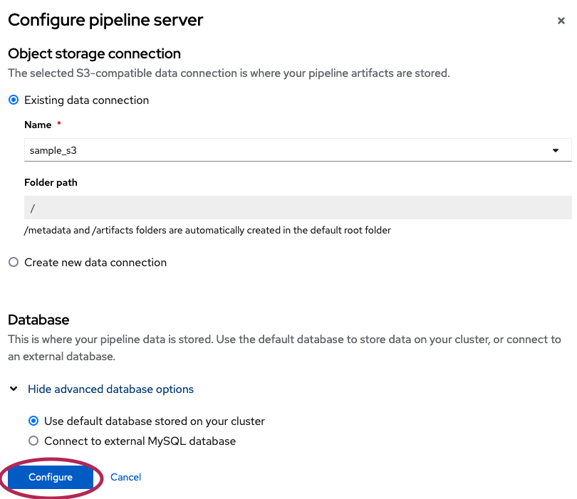


7.  Install Triton runtime in Model Trust data science project using OpenShift cli.
    1.  Set the context to Model Trust data science project: `oc project model-trust-ds-project`. 
    2.  Install Triton runtime: `oc apply -f resources/triton_runtime.yaml`. An example can be found [here](https://github.com/kserve/modelmesh-serving/blob/v0.11.1/config/runtimes/triton-2.x.yaml) as well. Verify if you are using correct triron image in this yaml. And make sure it is annotated with `enable-route: "true"`.
    3.  Query servingruntimes to confirm if triton is installed: `oc get servingruntimes`. Result must have an object named **triton-2.x**.
    ```
    NAME         DISABLED   MODELTYPE   CONTAINERS   AGE
    triton-2.x              keras       triton       4d1h
    ```

> **_NOTE:_** In order for models to use triton runtime, you need to set `runtime` to "triton" in model yaml.

8.   Make sure a default storage class is defined in the OpenShift cluster. 

9. The below steps assume that an ONNX serialized base regression model and data are available on AWS S3 or IBM Cloud Object Storage.
    1.  Upload calibration data with input features in csv format to AWS S3 .
    2.  Upload calibration data with target variable (ground truth) in csv format to S3.
    3.  Upload a trained regression model to AWS S3 or IBM Cloud Object Storage. The Model Trust algorithm generates prediction intervals for this model.

> **_NOTE:_** Upload all the input datasets/models to same S3 or COS instance. If different instances are to be used, you require to modify `resources/model_trust_pipeline.py` accordingly.

## Deploy Model Trust Pipeline From YAML

1.  Import `resources/model_trust_pipeline.yaml` to Model Trust data science project in ODH. This file uses default storage class configured in your OpenShift cluster and access mode `ReadWriteOnce`. If you require to modify these values, jump to [Deploy Model Trust Pipeline From Python](#deploy-model-trust-pipeline-from-python).

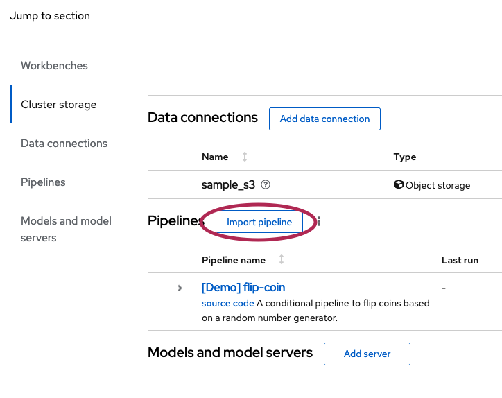

2.  Create a pipeline run. The pipeline run creation page lists all the input parameters required for Model Trust pipeline. It includes object storage (AWS S3 / IBM COS) credentials, OpenShift cluster credentials, data science project details on Open Data Hub, calibration data path and base regression model path on object storage, and the parameters for Model Trust's [Region Uncertainty Estimator](https://github.com/trustyai-explainability/trustyai-model-trust/blob/main/model_trust/regression/region_uncertainty_estimation.py#L29).

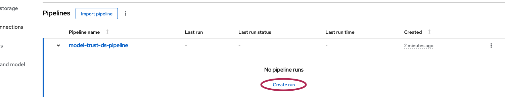

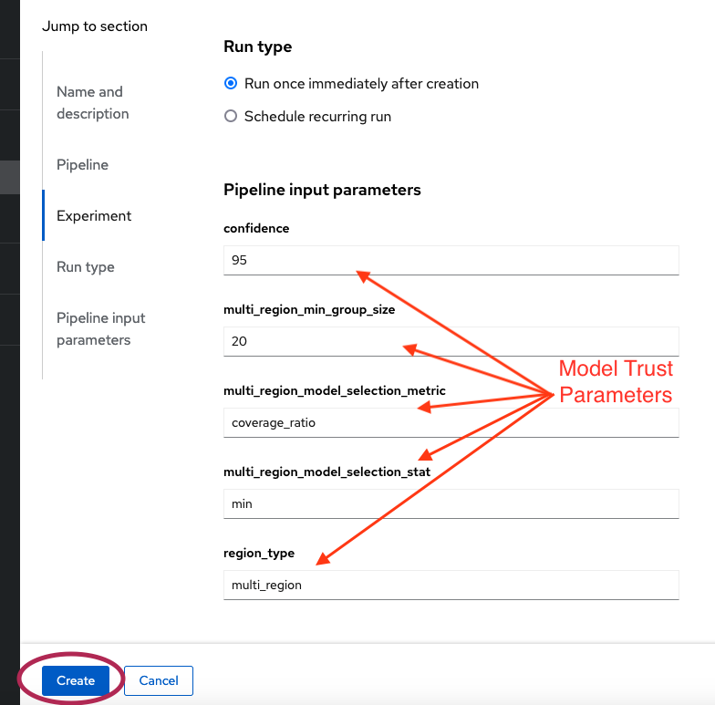

3.  Guidance to configure the Pipeline input parameters:
    -   **aws_access_key** : Access key for your AWS account. If you are using IBM Cloud Object Storage, generate the credentials with HMAC to get access key and secret key. This is used to download calibration data and base regression model from object storage, and upload trained Model Trust model to the storage for deployment on Model Mesh.
    -   **s3_endpoint** : Public or private endpoint to access your S3 bucket where input data and model are present. Defaults to "https://s3.us.cloud-object-storage.appdomain.cloud".
    -   **s3_region** : Region where the S3 bucket is provisioned. Defaults to "us-geo".
    -   **aws_secret** : Secret key for your AWS account. If you are using IBM Cloud Object Storage, generate the credentials with HMAC to get access key and secret key. This is used to download calibration data and base regression model from object storage, and upload trained Model Trust model to the storage for deployment on Model Mesh.
    -   **base_model_path** : Regression model path (Key) on S3. The Model Trust's uncertainty intervals are generated for this model. This model is often called as base model or base regression model throughout this note. The model is accepted only in ONNX format. Defaults to "onnx_models/base_onnx_model.onnx".
    -   **calibration_data_x_path** : Path (Key) on S3 for calibration input data. It is expected to be prepared during training of the original regression model but not used for training or validation of the model. This dataset is used to train Model Trust model. The data is accepted only in csv format and should contain all input features required for the base regression model. Defaults to "simulated_data/x_cal.csv".
    -   **calibration_data_y_path** : Path (Key) on S3 for calibration target data. It is expected to be prepared during training of the original regression model but not used for training or validation of the model. This dataset is used to train Model Trust model. The data is accepted only in csv format and should contain all target features that the base regression model predicts. Defaults to "simulated_data/y_cal.csv".
    -   **confidence** : Confidence of predicted interval by the Model Trust algorithm. Defaults to 95.
    -   **data_bucket** : Bucket name on S3 for calibration data. Defaults to "model-trust".
    -   **model_bucket** : Bucket name on S3 for base regression model. Defaults to "model-trust".
    -   **multi_region_min_group_size** : Minimum samples to be present in the region detected by the Model Trust algorithms. This value influences number of regions to be detected. This param is required only if region_type is set to "multi_region". Defaults to 20.
    -   **multi_region_model_selection_metric** : Model selection metric, can be selected among coverage_ratio, pinball_loss_ratio. This param is required only if region_type is set to "multi_region". Defaults to "coverage_ratio".
    -   **multi_region_model_selection_stat** : Model selection statistics, can be selected among min, max, average. This param is required only if region_type is set to "multi_region". Defaults to "min"
    -   **oc_host** : OpenShift server API URL.
    -   **oc_token** : Oauth token to access OpenShift server.
    -   **oc_user** : User used to access OpenShift server. Defaults to admin user: "kube:admin".
    -   **odh_data_connection_name** : Data connection name that is created for your AWS S3 / IBM COS instance in [Setup](#setup). This is required to retrieve the Model Trust model from object storage and deploy on Model Mesh. Defaults to "aws-connection-samples3".
    -   **odh_ds_project_name** : Data science project name that is created for Model Trust demo in [Setup](#setup). This is required to deploy the Model Trust model on Model Mesh. Defaults to "model-trust-ds-project".
    -   **region_type** : Region model that to be used to predict intervals. It must be one of "single_region", "multi_region". **single_region** predicts single region for the entire data. This usually is broader and may not be useful for datasets with varying distribution. **multi_region** predicts multiple regions in the dataset. This is useful to predict complex patterns in the dataset. When this option is selected, you may configure **multi_region_min_group_size**, **multi_region_model_selection_metric**, and **multi_region_model_selection_stat** as required. Defaults to "multi_region".
4. After the pipeline execution is completed, you can find the model service name from input/output details of `deploy-model-trust-model` stage.
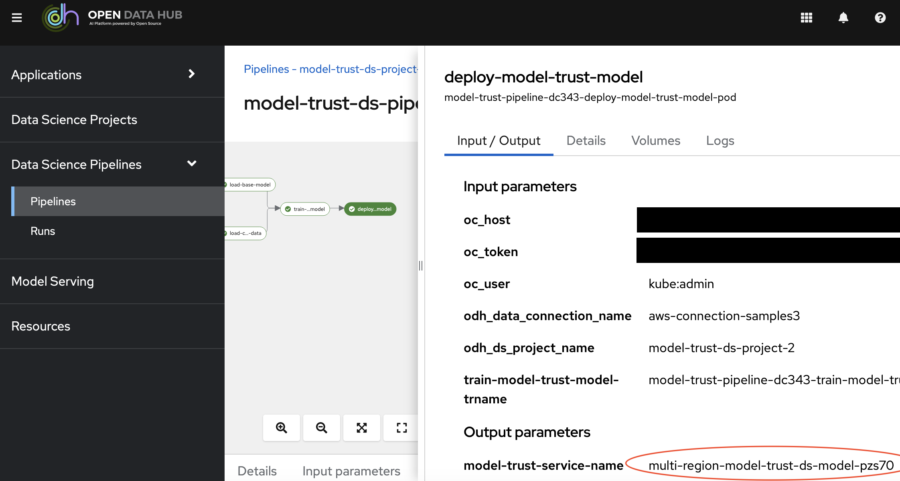

Jump to [Deploy Model Trust Pipeline From Python](#deploy-model-trust-pipeline-from-python), if you like to do any of the following customizations.
*  customize the object storage for calibration data, base regression model, or trained Model Trust model.
*  customize stages or logic within the stages in the Model Trust data science pipeline.
*  use a different storage class.
*  configure more resources for larger data or models.
*  any customization on top of `resources/model_trust_pipeline.yaml`.


## Deploy Model Trust Pipeline From Python

You can modify the Model Trust pipeline stages in `model_trust_pipeline.py` to suite your custom requirements.

1.  Create a `.env` file using template `.env_template`: `cp resources/.env_template resources/.env`
2.  Fill the configuration details in `.env`.
    *   DEFAULT_STORAGE_CLASS: If this value is not configured, generated yaml will have `kfp-csi-s3`. Update this variable to use to a different storage class in your cluster. If you like to use default storage class in your cluster without modifying this variable, delete `storageClassName` field from the generated yaml file. Follow [this link](https://tekton.dev/docs/pipelines/workspaces/#using-persistent-volumes-within-a-pipelinerun) for more details.
    *   DEFAULT_ACCESSMODES: If this value is not configured, generated yaml will have `ReadWriteMany`. Follow [this link](https://tekton.dev/docs/pipelines/workspaces/#using-persistent-volumes-within-a-pipelinerun) for more details.
    *   TRAINING_MEMORY_REQUEST: Memory request used by Model Trust training pod. If this variable is not configured, default is set to "2G".
    *   TRAINING_MEMORY_LIMIT: Memory limit used by Model Trust training pod. If this variable is not configured, default is set to "4G".
    *   TRAINING_CPU_REQUEST: CPU request used by Model Trust training pod. If this variable is not configured, default is set to "1".
    *   TRAINING_CPU_LIMIT: CPU limit used by Model Trust training pod. If this variable is not configured, default is set to "2".
3.  Setup Python environment with 3.9+ if you do not have it. Install python requirements: `pip install -r resources/requirements.txt`.
4.  Compile Model Trust pipeline: `python resources/model_trust_pipeline.py`. A file named `model_trust_pipeline.yaml` will be generated in `resources` directory.
5.  Follow the steps in [Deploy Model Trust Pipeline From YAML](#deploy-model-trust-pipeline-from-yaml)


